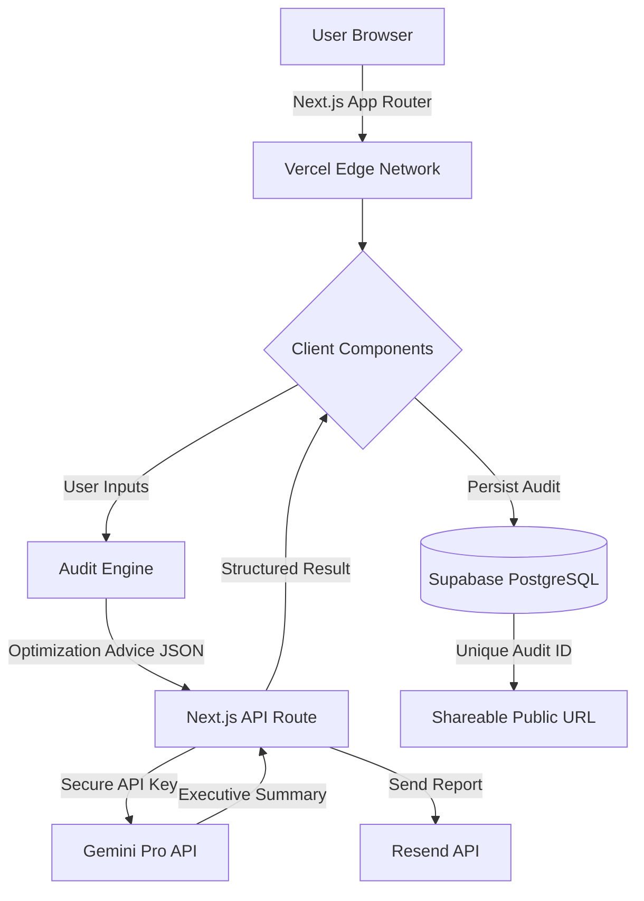

#  ARCHITECTURE.md: System Design & Data Flow

This document outlines the architectural decisions, system flow, and scaling considerations behind **SpendLens**.

---

#  System Diagram



---

#  Data Flow: Input → Audit Result

## 1.  User Input Collection

The process begins inside the `AuditForm` component.

Users provide:

- AI tools currently being used
- Pricing tiers
- Team size
- Seat counts
- Billing preferences

This data remains entirely client-side during the initial audit stage to ensure fast interactions.

---

## 2.  The “Defensible” Audit Engine

Before any AI requests occur, the frontend executes a deterministic TypeScript-based audit engine.

The engine:

- Maps selected tools against predefined `TOOL_PRICES`
- Calculates current monthly spend
- Calculates optimized pricing scenarios
- Detects redundant subscriptions
- Generates projected savings

This logic intentionally avoids AI involvement.

### Why?

LLMs are unreliable with financial arithmetic.

All savings calculations are therefore handled entirely through strict TypeScript logic to ensure:

- Predictability
- Auditability
- Financial accuracy
- No hallucinated numbers

---

## 3.  Context Construction

After calculations complete, the frontend generates a clean structured JSON payload called:

```ts
OptimizationAdvice[]
```

Each object contains:

- Tool name
- Current spend
- Optimized spend
- Monthly savings
- Recommendation type

This acts as the “source of truth” passed into the AI layer.

---

## 4.  AI Executive Summary Generation

The structured JSON is sent to a secure server-side API route:

```txt
/api/generate-summary
```

Inside this route:

- A strict system prompt is applied
- Gemini Pro generates a concise executive summary
- The AI is forbidden from inventing numbers

The summary focuses only on:

- Strategic wins
- Optimization insights
- Infrastructure savings opportunities

This keeps the AI role constrained to communication instead of calculation.

---

## 5.  Persistence Layer

Once the audit is complete:

- The full audit result is saved to **Supabase**
- A unique audit UUID is generated
- Sensitive user data remains protected through RLS policies

Stored data includes:

- Audit results
- Savings totals
- Tool selections
- Generated summary
- Timestamp metadata

---

## 6.  Report Delivery

After persistence:

- **Resend API** sends a personalized audit report email
- The email contains:
  - Executive summary
  - Savings breakdown
  - Shareable report link

This creates the core “viral loop” mechanism of the platform.

---

## 7.  Public Shareable Audit

Each audit receives a unique public URL:

```txt
/audit/[id]
```

The public route fetches only non-sensitive audit data from Supabase.

Private information such as:

- Email addresses
- Internal metadata
- User identifiers

remain inaccessible due to strict Row Level Security policies.

---

# Why I Chose This Stack

## Next.js 15 (App Router)

Chosen because it supports:

- Hybrid rendering
- Server-side API routes
- Fast routing
- Strong Vercel deployment integration

I specifically used:

- Client Components → Interactive audit experience
- Server Routes → Secure Gemini and Resend communication

This created a clean separation between frontend interactions and secure backend logic.

---

##  TypeScript

TypeScript was essential because the project involves financial calculations.

Strict typing helped prevent:

- `NaN` errors
- Undefined pricing states
- Incorrect arithmetic operations
- Unsafe AI response handling

The audit engine would have been significantly riskier in plain JavaScript.

---

##  Supabase (PostgreSQL)

I switched from Firebase to Supabase because relational data fit the problem much better.

Benefits included:

- Structured audit records
- Better querying capabilities
- Reliable UUID handling
- Native PostgreSQL flexibility
- Row Level Security (RLS)

This became especially important for secure public sharing functionality.

---

##  Framer Motion

Framer Motion was added to give SpendLens a polished SaaS-like experience.

It improved:

- Perceived responsiveness
- UI smoothness
- Professional presentation quality

The animations were intentionally subtle to maintain a finance-product aesthetic.

---

#  Scaling to 10k Audits/Day

If SpendLens needed to support 10,000+ audits daily, I would redesign several parts of the architecture.

---

## 1.  Redis Caching (Upstash)

Many users generate extremely similar audits.

Instead of repeatedly paying for identical AI summaries, I would:

- Hash audit configurations
- Cache Gemini responses in Redis
- Reuse summaries for matching setups

This would significantly reduce:

- Gemini API costs
- Response latency

---

## 2.  Background Job Queue

Currently, summary generation and email delivery happen synchronously.

At scale, I would move these into a queue system such as:

- BullMQ
- Inngest
- Trigger.dev

This would:

- Prevent UI blocking
- Improve reliability
- Retry failed email jobs automatically
- Smooth traffic spikes

---

## 3.  Edge Functions

The audit calculations could be moved to Vercel Edge Functions.

Benefits:

- Lower latency globally
- Faster response times
- Better scalability during traffic surges

This would improve performance for international users.

---

## 4.  Rate Limiting & Abuse Protection

Since Gemini API credits are expensive, strict abuse prevention would become critical.

I would implement:

- IP-based rate limiting
- CAPTCHA verification
- Request throttling
- Audit quotas for anonymous users

This would protect infrastructure costs during public launches.

---
## 5.  Analytics & Observability

At larger scale, observability becomes essential.

I would add:

- PostHog for product analytics
- Sentry for error monitoring
- OpenTelemetry tracing
- Database performance monitoring

This would help identify:

- Bottlenecks
- Failed audit flows
- Slow API routes
- User drop-off points

---

#  Core Architectural Philosophy

SpendLens was intentionally designed around one core principle:

> Deterministic financial logic + constrained AI communication.

The AI layer generates language, not truth.

All pricing calculations, savings logic, and optimization rules remain fully deterministic and auditable within the TypeScript audit engine.

This separation makes the platform:

- More trustworthy
- Easier to debug
- Safer to scale
- More suitable for enterprise usage

---